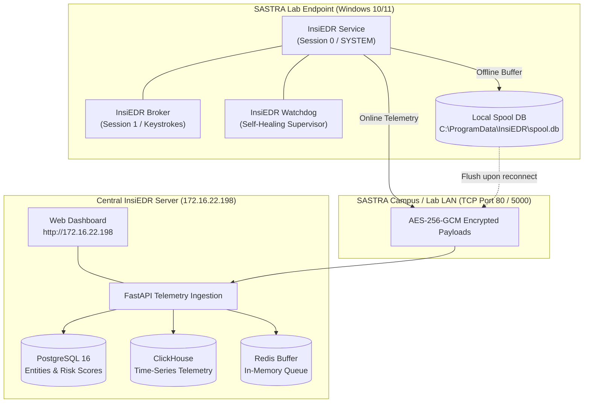

# InsiEDR Lab Deployment & Operations Manual
**Target Environment:** SASTRA University Computer Laboratories  
**Observation Period:** 10 – 14 Days  
**Audience:** Lab Administrators, Research Coordinators, System Technicians (Non-Developer Friendly)

---

## 1. System Architecture & Workflow

InsiEDR operates as a lightweight, distributed Endpoint Detection and Response system. During the 10–14 day observation period, lab computers stream system telemetry and keystroke biometrics to a centralized server.



---

## 2. Pre-Deployment Checklist

Before deploying on any machine, verify the following prerequisites:

| Item | Requirement | Why It Matters |
| :--- | :--- | :--- |
| **Server Hardware** | Quad-core CPU, 8 GB+ RAM, 50 GB+ free disk space | Stores telemetry for 30–60 lab PCs over 14 days. |
| **Server Network** | Static LAN IP (`172.16.22.198`) | Central InsiEDR deployment IP. |
| **Server Firewall** | Inbound TCP Port `80` (Nginx) & `5000` allowed | Ensures agent telemetry payloads are accepted without blocking. |
| **Lab PC OS** | Windows 10 or Windows 11 (64-bit) | Native Rust sensors are compiled for Windows 64-bit (`x86_64`). |
| **Lab Permissions** | Local Administrator access on Lab PCs | Needed to register the background Windows Service. |
| **Reboot Freeze Software** | If *Deep Freeze* or *Shadow Defender* is active, thaw during install | Otherwise, the service will disappear when the PC restarts. |

> [!IMPORTANT]
> **Deep Freeze Notice:** If your lab uses reboot-restore software (e.g., Faronics Deep Freeze), you must **Thaw** the workstations before installing InsiEDR, or configure a ThawSpace directory for `C:\Program Files\InsiEDR` and `C:\ProgramData\InsiEDR`. Once installed, you can re-freeze the systems.

---

## 3. Central Server Setup (One-Time Setup)

The server receives encrypted payloads, stores them in PostgreSQL and ClickHouse, and hosts the Web Dashboard.

### Step 3.1: Server Deployment IP
The server's designated laboratory IP is:
```
172.16.22.198
```
*Note:* All agent packages are pre-configured to communicate with `http://172.16.22.198` directly on Port 80 (routed via Nginx reverse proxy).

### Step 3.2: Allow Port 80 & 5000 Through Windows Firewall
Run these commands in an Administrator Command Prompt on the server:
```cmd
netsh advfirewall firewall add rule name="InsiEDR Ingress Port 80" dir=in action=allow protocol=TCP localport=80
netsh advfirewall firewall add rule name="InsiEDR Backend Port 5000" dir=in action=allow protocol=TCP localport=5000
```

### Step 3.3: Start the InsiEDR Server

#### Option A: Docker Deployment (Recommended)
If Docker Desktop is installed on the server:
1. Open terminal in `D:\Projects\AISH\InsiEDR-server`.
2. Start the full cluster with one command:
   ```cmd
   docker compose up -d
   ```
3. Verify that all 5 containers (`db`, `redis`, `clickhouse`, `backend`, `nginx`) show status `Up`:
   ```cmd
   docker compose ps
   ```

#### Option B: Standalone Native Python Deployment
If running without Docker directly on Windows:
1. Open PowerShell in `D:\Projects\AISH\InsiEDR-server`.
2. Activate your Python environment or ensure dependencies are installed:
   ```powershell
   pip install -r requirements.txt
   ```
3. Start the FastAPI server on port 5000:
   ```powershell
   uvicorn server.app:app --host 0.0.0.0 --port 5000 --workers 4
   ```

### Step 3.4: Verify Server Health
Open Google Chrome or any browser on the server (or another PC on the same Wi-Fi/LAN) and visit:
* **Dashboard:** `http://172.16.22.198` (or `http://localhost:5000` on the server itself)
* **API Health Check:** `http://172.16.22.198/api/health`

You will see the **InsiEDR Enterprise Threat Defense Center** web interface.

---

## 4. Preparing the Agent Package

The complete deployment bundle is located at:
`D:\Projects\AISH\InsiEDR-agent\deploy\InsiEDR-Package`

### What is Inside `InsiEDR-Package`:
* `insiedr-service.exe` — Primary Session 0 Windows Service (silent, native Rust).
* `insiedr-broker.exe` — Desktop helper capturing keystroke biometrics in user session.
* `insiedr-watchdog.exe` — Anti-tamper supervisor daemon.
* `agent_config.json` — Pre-configured agent configuration file.
* `install.bat` — One-click silent installer.
* `uninstall.bat` — Clean uninstaller.
* `status.bat` — Health verification script.

### Step 4.1: Verify Pre-Configured Server IP
The configuration file `agent_config.json` is **already pre-configured** for the deployment server:
```json
{
  "server_url": "http://172.16.22.198",
  "crypto_scheme": "aes-256-gcm",
  "key_id": "default",
  "aes_key_base64": "5Ui8tuHn2kDMrCreumXzRVRFjeUg6aB4DzpfBPAactc=",
  "heartbeat_interval_secs": 5,
  "spool_db_path": "C:\\ProgramData\\InsiEDR\\spool.db"
}
```
No manual editing is required on individual lab machines unless the server IP changes.

---

## 5. Lab Endpoint Installation (Agent Rollout)

### Method A: USB Drive Installation (Best for 10–30 PCs)
1. Copy the entire `InsiEDR-Package` folder to a USB pen drive.
2. Insert the USB drive into the target lab PC.
3. Open the `InsiEDR-Package` folder on the USB.
4. Right-click **`install.bat`** and select **"Run as administrator"**.
5. The installer will:
   * Create `C:\Program Files\InsiEDR\` and copy all sensor binaries.
   * Lock directory permissions so students cannot tamper with or delete files.
   * Register the `InsiEDR` service with automatic startup on boot.
   * Configure 3-second automatic recovery if the process is ever killed.
   * Start the service immediately.
6. A green confirmation banner will appear:
   ```
   ==========================================================
    [✓] SUCCESS: InsiEDR Sensor is ACTIVE and RUNNING!
   ==========================================================
   ```
7. Unplug the USB drive and proceed to the next PC. Each PC takes **under 30 seconds**.

---

### Method B: Network Share Installation (Best for 30–60+ PCs)
Instead of walking around with a USB drive, host the package over the lab network:
1. On the Server or Master PC, right-click the `InsiEDR-Package` folder $\rightarrow$ **Properties** $\rightarrow$ **Sharing** $\rightarrow$ **Share...**
2. Add `Everyone` with **Read** permissions. Note the network path (e.g. `\\172.16.22.198\InsiEDR-Package`).
3. On any lab PC:
   * Press `Windows Key + R`, enter `\\172.16.22.198\InsiEDR-Package`.
   * Right-click `install.bat` $\rightarrow$ **"Run as administrator"**.

---

### Method C: Mass Remote Deployment (PowerShell)
For advanced lab administrators with Administrator credentials across all systems:
```powershell
$LabComputers = @("LAB-PC01", "LAB-PC02", "LAB-PC03", "LAB-PC04")
foreach ($pc in $LabComputers) {
    Write-Host "[*] Deploying to $pc..."
    Copy-Item -Path "\\172.16.22.198\InsiEDR-Package" -Destination "\\$pc\C$\Temp\InsiEDR-Package" -Recurse -Force
    Invoke-Command -ComputerName $pc -ScriptBlock {
        cmd.exe /c "C:\Temp\InsiEDR-Package\install.bat"
    }
}
```

---

## 6. Verifying Agent Health on Lab PCs

To confirm the agent is working properly on any lab PC:
1. Double-click `status.bat` inside `C:\Program Files\InsiEDR\` or in the package folder.
2. Look for:
   * `STATE: 4 RUNNING`
   * `insiedr-service.exe` active under `NT AUTHORITY\SYSTEM`.
   * `insiedr-broker.exe` active under the logged-in student user.
3. Check Task Manager (`Ctrl + Shift + Esc`):
   * CPU utilization should hover at **0.0% to 0.5%** (capped at a strict maximum of 3.0%).
   * Memory usage is minimal (15–30 MB).
   * It runs completely silently in the background with zero popups or tray icons.

---

## 7. 10–14 Days Operational & Monitoring Playbook

### Daily 3-Minute Routine (Morning Check)
Every morning, the lab coordinator or student in-charge should spend 3 minutes checking the central dashboard:

1. Open `http://172.16.22.198` in Google Chrome.
2. **Fleet Overview Tab**:
   * Verify the number of "Active Agents" matches the lab PCs currently turned on.
   * If a PC was turned off overnight, its card will say "OFFLINE". As soon as students boot the PC in the morning, it will flip to "ONLINE" within 5 seconds automatically.
3. **Telemetry Stream Tab**:
   * Observe live incoming rows (process launches, network requests, keystroke flight times).
4. **Server Storage Status**:
   * Ensure the server hard drive has sufficient free storage space.

### Expected Behavior During Common Lab Events

| Scenario | What Happens | What You Need To Do |
| :--- | :--- | :--- |
| **PC Powered Off Overnight** | Agent shuts down cleanly. No data is lost. | Nothing. Service auto-starts when PC turns on. |
| **Network Cable Unplugged / Wi-Fi Disconnected** | Agent automatically diverts all logs into `C:\ProgramData\InsiEDR\spool.db` (local SQLite cache). | Nothing. As soon as network reconnects, spool flushes all logs to the server. |
| **Student Tries to End Process in Task Manager** | Windows displays "Access Denied" due to SYSTEM DACLs. If killed by an administrator, the Windows Service Manager automatically restarts it within 3 seconds. | Nothing. Self-healing watchdog prevents termination. |
| **PC Reboots for Windows Updates** | Service starts before any student logs in (`start= auto`). | Nothing. Logging resumes seamlessly. |

---

## 8. Exporting Research Data & Final Management

At the end of the 10–14 day study period, export your research datasets directly from the Web Dashboard or via direct browser download links.

### Download Endpoints (Excel & CSV):

| Dataset Type | Download URL | Description |
| :--- | :--- | :--- |
| **Keystroke Biometrics (Excel)** | `http://172.16.22.198/api/v1/export/keystrokes.xlsx` | Key hold duration, flight time, typing speed cadence. |
| **Keystroke Biometrics (CSV)** | `http://172.16.22.198/api/v1/export/keystrokes.csv` | Comma-separated format for Python / Pandas / R. |
| **All Sensor Features (Excel)** | `http://172.16.22.198/api/v1/export/features.xlsx` | High-level aggregated behavioral feature vectors. |
| **All Sensor Features (CSV)** | `http://172.16.22.198/api/v1/export/features.csv` | Tabular feature rows ready for ML modeling. |
| **Raw Telemetry Logs (CSV)** | `http://172.16.22.198/api/v1/export/logs.csv` | Full raw event stream (process, file, network, auth). |
| **Full ML Training Dataset** | `http://172.16.22.198/api/v1/export/training-dataset.xlsx` | Pre-labeled baseline vs anomalous session records. |

### Exporting via the Web Dashboard:
1. Click the **Export** button located in the top navigation bar.
2. Select your desired format (`Excel .xlsx` or `CSV`).
3. Select your desired date range (e.g., Start Date: Day 1, End Date: Day 14).
4. Click **Download Dataset**.

---

## 9. Post-Study Decommissioning & Cleanup

Once all datasets have been verified and backed up, remove the sensors from lab PCs:

1. Insert your USB drive or access the network share on the lab PC.
2. Right-click **`uninstall.bat`** $\rightarrow$ **"Run as administrator"**.
3. The script will:
   * Stop the `InsiEDR` service.
   * Remove the service from the Windows registry.
   * Delete binaries from `C:\Program Files\InsiEDR`.
   * Ask whether to delete local spool cache (`C:\ProgramData\InsiEDR`). Press Enter to delete.
4. The system is restored to its exact original state.

---

## 10. Non-Developer Troubleshooting Guide

### Q1: "The PC is turned on, but doesn't show up on the Server Dashboard."
* **Cause 1:** Server IP is incorrect in `agent_config.json`.
  * *Fix:* Check `C:\Program Files\InsiEDR\agent_config.json` in Notepad. Confirm `server_url` matches the Server IP.
* **Cause 2:** Server firewall is blocking incoming traffic.
  * *Fix:* On the server, run the firewall rule command in Step 3.2.
* **Cause 3:** Network connectivity issue between lab PC and server.
  * *Fix:* Open PowerShell on the lab PC and run:
    ```powershell
    Test-NetConnection -ComputerName 172.16.22.198 -Port 80
    ```
    If `TcpTestSucceeded : True`, the connection is working.

### Q2: "Can students notice the agent running?"
* **No.** InsiEDR runs with no tray icon, no desktop notifications, and no sound. CPU usage is strictly hardware-governed to stay under **3%**, ensuring laboratory compilation (Visual Studio, GCC, Java) and academic tasks are completely unaffected.

### Q3: "What if the Server crashes or loses power during the observation?"
* All lab agents automatically switch to **Offline Spooling Mode**. Telemetry is securely buffered inside `C:\ProgramData\InsiEDR\spool.db`. When the server boots back up, agents automatically detect the server and flush the queued data in chronological order. No data is lost.
