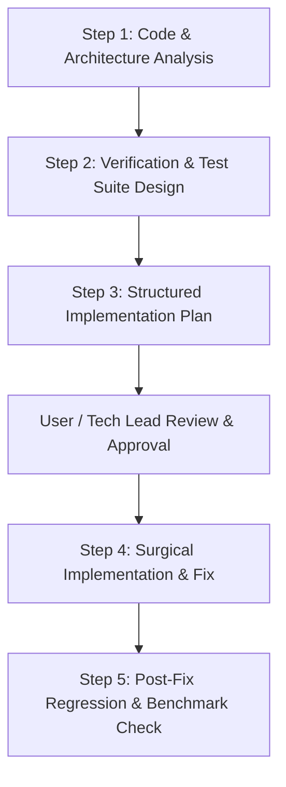

# InsiEDR-Agent: AI Engineering & Prompt Guidebook

> **Target Workspace**: `InsiEDR-agent`  
> **Role**: Low-footprint, kernel/userland endpoint telemetry collector and active response sensor.

---

## 1. The 6 Engineering Perspectives (Agent Scope)

When any AI agent inspects, plans, tests, or modifies code in `InsiEDR-agent`, it must adhere strictly to these 6 pillars:

```
                  ┌────────────────────────────────────────────────────────┐
                  │              INSI-EDR AGENT: 6 PILLARS                 │
                  └──────────────────────────┬─────────────────────────────┘
          ┌─────────────────────┬────────────┴────────────┬─────────────────────┐
          ▼                     ▼                         ▼                     ▼
   [1. Architecture]       [2. Design]              [3. Security]         [4. Reliability]
   Deterministic pipeline, Decoupled collectors,    Anti-tamper, safe     Zero OS crash/panic,
   bounded channels,       error-type encapsulation, IPC, token validation bounded RAM (<60MB),
   isolated worker threads clean abstractions        least privilege       CPU throttling (<1.5%)
                                ┌─────────────────────────┴─────────────────────┐
                                ▼                                               ▼
                         [5. Adaptability]                           [6. Developer Experience]
                         Cross-platform (Win/Linux/Mac),             Idiomatic code, clear docstrings,
                         dynamic config hot-reloading                strong typing, mock fixtures
```

1. **Architecture**:
   - Clear pipeline stages: `Kernel/OS Hooks -> Event Filtering -> Queue/Ring Buffer -> Compression/Batching -> Secure Transport`.
   - Bounded channels only (e.g., Tokio mpsc with explicit capacity limits or thread-safe circular queues). Never use unbounded channels.
   - Isolated thread pools/tasks so a slow network transport does not block kernel event ingestion.
2. **Design**:
   - Single Responsibility Principle (SRP): event collectors (Process, Network, File, Registry, Memory) must remain independent and interchangeable.
   - Robust error encapsulation: Use domain-specific error enums; no raw string errors or generic error swallowing.
3. **Security & Anti-Tamper**:
   - Protect the agent process against termination, code injection, and handle inspection.
   - Validate and authenticate all inbound server commands (e.g., isolate host, kill process, collect artifact) using digital signatures or HMAC tokens.
   - Strict memory safety: Zero unsafe pointer operations without documented safety audits and invariants.
4. **Reliability & Resource Boundaries**:
   - **Zero Crash Policy**: Never cause a Kernel Panic or Blue Screen of Death (BSOD); never crash the userland daemon with an unhandled panic/exception.
   - **Resource Quotas**: Memory footprint must stay below 60 MB resident working set; average CPU utilization under 1.5%.
   - **Backpressure & Offline Resilience**: Local ring buffer with FIFO/priority drop policy when offline storage hits capacity limits.
5. **Adaptability**:
   - Cross-platform modularity: Clean abstractions over Windows (ETW, Minifilter), Linux (eBPF, auditd), and macOS (EndpointSecurity).
   - Hot configuration reloading without requiring service restarts.
6. **Developer-Friendly Code**:
   - Idiomatic formatting, strict typing, complete docstrings for public interfaces, and deterministic, fast-running unit tests with mocks.

---

## 2. Standard AI Agent Workflow for InsiEDR-Agent

Any AI agent assigned to work on this repository must follow this non-negotiable 4-phase lifecycle:



---

## 3. Master Prompts for InsiEDR-Agent

Copy and paste these prompts directly to instruct your AI agent for specific tasks.

### Prompt 1: Codebase Analysis & Root-Cause Triage
```markdown
### TASK: INSI-EDR AGENT CODE ANALYSIS & ROOT CAUSE TRIAGE

#### CONTEXT:
You are an expert Systems Security & EDR Kernel/Userland Software Engineer auditing the `InsiEDR-agent` repository. The agent runs as a privileged endpoint sensor where system stability, low latency, tamper resistance, and zero OS impact are paramount.

#### OBJECTIVE:
Analyze the specified code or reported bug across all 6 engineering dimensions (Architecture, Design, Security, Reliability, Adaptability, Developer Experience). Do NOT write implementation fixes yet; focus purely on deep diagnosis and structural assessment.

#### SCOPE:
- Target File(s) / Subsystem: {{INSERT_TARGET_FILES_OR_COMPONENT}}
- Reported Issue / Symptom: {{INSERT_ISSUE_OR_BEHAVIOR_DESCRIPTION}}

#### ANALYSIS INSTRUCTIONS:
1. **Architecture & Concurrency**:
   - Trace the event pipeline from capture to dispatch.
   - Detect race conditions, deadlocks, lock contention, or unbounded channel buffers.
   - Verify async task and thread lifecycle management.
2. **Design & Modularity**:
   - Check if event collectors are decoupled from transport and filtering.
   - Verify error handling and ensure absence of unwraps/panics in production paths.
3. **Security & Anti-Tamper**:
   - Identify privilege escalation, handle hijack, or bypass risks.
   - Check whether an adversary could blind the sensor (e.g., event flooding).
4. **Reliability & Resource Consumption**:
   - Detect memory leaks, dangling pointers, unsafe raw pointer dereferences, or unbounded allocations.
   - Evaluate behavior under extreme load (100k events/sec) and offline conditions.
5. **Adaptability**:
   - Check OS-specific abstractions and config hot-reloading behavior.
6. **Developer Ergonomics**:
   - Review code readability, type safety, error clarity, and metric instrumentation.

#### DELIVERABLE FORMAT:
1. **Executive Summary**: 2-3 sentence overview of the subsystem health.
2. **Defect & Vulnerability Matrix**: Table listing Severity, Location, Bug Class, and Impact.
3. **Root Cause Analysis (RCA)**: Deep technical walkthrough of why the defect occurs.
4. **Architectural & Host Stability Risks**: Potential side-effects on the OS or other collectors.
5. **Recommended Mitigation Strategy**: High-level approach before drafting code.
```

---

### Prompt 2: Rigorous Test Suite Generation
```markdown
### TASK: INSI-EDR AGENT TEST SUITE DESIGN & IMPLEMENTATION

#### CONTEXT:
You are an expert QA and Reliability Engineer specialized in Endpoint Detection & Response (EDR) software. You are writing automated tests for `InsiEDR-agent`.

#### OBJECTIVE:
Create a rigorous, multi-tiered test suite for the specified agent component. Tests must validate functional correctness, edge cases, failure recovery, and resource boundaries without destabilizing the host.

#### SCOPE:
- Target Component: {{INSERT_TARGET_COMPONENT}}
- Existing Test Files: {{INSERT_TEST_PATHS}}

#### TESTING REQUIREMENTS:
1. **Unit Tests**:
   - Test event serialization/deserialization (Protobuf / JSON / Cap'n Proto).
   - Test event filtering, deduplication, and rate-limiting algorithms.
   - Test malformed, truncated, and boundary-value inputs.
2. **Mocking & Isolation**:
   - Mock OS kernel event providers (ETW, eBPF, auditd).
   - Mock transport disconnections, TLS handshake timeouts, and server 5xx errors.
3. **Reliability & Backpressure Testing**:
   - Test queue overflow: Verify FIFO or priority drop policies when the buffer is 100% full.
   - Test reconnection storms with exponential backoff and jitter.
4. **Security & Boundary Tests**:
   - Fuzz event parsers with arbitrary byte streams.
   - Verify that response commands (e.g. process termination) require valid authentication tokens.
5. **Resource Benchmarks**:
   - Verify memory allocations remain bounded after processing 500,000 synthetic events.

#### DELIVERABLE FORMAT:
1. **Test Strategy & Matrix**: Table of test cases (Unit, Integration, Failure, Security).
2. **Executable Test Code**: Production-ready test files using the project's native test framework.
3. **Mock Implementations**: Clean mock interfaces for OS events and network sockets.
4. **Run Instructions**: Exact shell commands to execute the tests and measure code coverage.
```

---

### Prompt 3: Structured Implementation Plan Generator
```markdown
### TASK: INSI-EDR AGENT IMPLEMENTATION PLAN CREATION

#### CONTEXT:
You are the Lead Systems Architect for `InsiEDR-agent`. You are formulating a comprehensive, phased Implementation Plan to resolve an issue or implement a critical feature.

#### OBJECTIVE:
Produce a step-by-step, reviewable Implementation Plan that guarantees zero regressions, zero OS crashes, preserved backward compatibility, and adherence to the 6 Core Engineering Pillars.

#### INPUT DETAILS:
- Problem Statement / Feature Goal: {{INSERT_PROBLEM_OR_FEATURE}}
- Root Cause Analysis Summary: {{INSERT_ANALYSIS_SUMMARY}}
- Affected Files: {{INSERT_AFFECTED_FILES}}

#### REQUIRED PLAN STRUCTURE:
1. **Scope & Objectives**: Clear definition of Done and Out-of-Scope boundaries.
2. **Architectural & Design Considerations**: Data struct changes, lock hierarchy, and thread safety.
3. **Security & Anti-Tamper Assessment**: Impact on agent privileges, IPC, and memory safety.
4. **Reliability & Performance Impact**: Expected CPU/RAM delta and fallback recovery paths.
5. **Phase-by-Phase Execution Roadmap**:
   - Phase 1: Pre-requisite Refactoring & Interface Setup (zero behavioral change).
   - Phase 2: Core Logic Implementation (safe, incremental modifications).
   - Phase 3: Test Coverage & Verification (unit, mock, and integration tests).
   - Phase 4: Benchmarking & Profiling (CPU/RAM verification).
6. **Rollback & Safety Plan**: How to revert or disable the feature via config flag.
7. **File-by-File Modification Checklist**: Detailed table of files to modify or create with rationale.
```

---

### Prompt 4: Surgical Bug Fix & Refactoring Engine
```markdown
### TASK: INSI-EDR AGENT SURGICAL BUG FIX & CODE IMPLEMENTATION

#### CONTEXT:
You are an expert Systems Programmer implementing an approved fix for `InsiEDR-agent`.

#### OBJECTIVE:
Implement the approved Implementation Plan with surgical precision, writing idiomatic, clean, secure, and developer-friendly code.

#### INPUT:
- Approved Implementation Plan: {{INSERT_APPROVED_PLAN}}
- Specific Phase to Execute: {{INSERT_PHASE_NUMBER_OR_ALL}}

#### CODING STANDARDS & CONSTRAINTS:
1. **Safety First**: No unhandled errors, no unchecked unwraps/panics, no raw pointer dereferences without unsafe audit comments.
2. **Resource Throttling**: All network, file, and queue operations must have bounds and timeouts.
3. **Thread Safety**: Ensure all shared state is synchronized using standard safe concurrency primitives with minimal lock hold times.
4. **Documentation**: Add clear comments explaining non-trivial logic, lock acquisition orders, and safety invariants.
5. **Preserve Compatibility**: Do not break existing serialization schemas or server contracts without backward-compatible fallbacks.

#### OUTPUT FORMAT:
For each modified file:
1. **File Path**: Full workspace path.
2. **Code Implementation**: Complete replacement chunks or clean diffs.
3. **Explanation of Changes**: Technical rationale behind every non-trivial change.
4. **Verification Step**: Specific command or test to run to confirm success without regressions.
```
